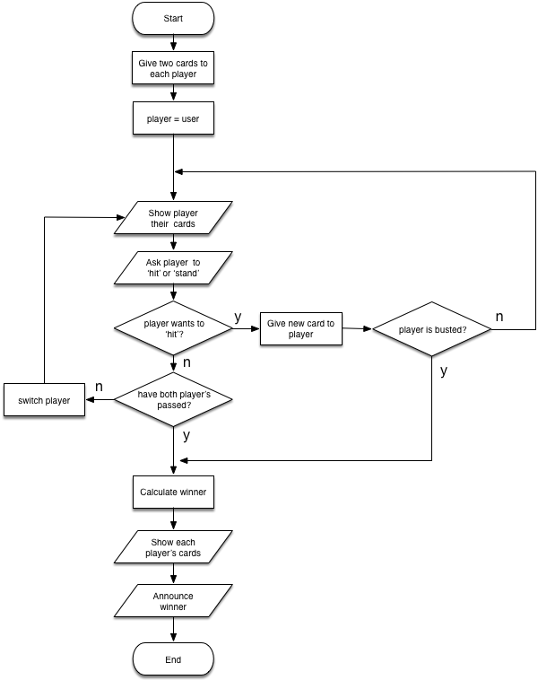

# Blackjack Exercise

A little assignment to produce a simplified version of the card game, [Blackjack](https://en.wikipedia.org/wiki/Blackjack).

## The goal

The goal of this assignment is to practice logic and loops in Java.

## Instructions

Complete this project, such that it allows a user to play a simplified version of the game of Blackjack against a virtual dealer.

In our simplified version of Blackjack, the play unfolds as follows:

1. Two cards are dealt and displayed to the user.
1. Two cards are dealt to the dealer, but these are secret and not displayed to the user.
1. The user is prompted whether they would like an additional card (a "hit"). This question is repeated and the user may accept as many additional cards as they would like, until they respond with the words "stand", "stop", or "pass". If the value of the cards exceeds 21 at any point during this process of accepting cards, the user has "busted" and lost, and the game ends.
1. Assuming the user has not busted, once the user stops accepting new cards, the robotic dealer decides whether to accept as many additional cards as it wants. You can have the robot dealer do this at random if you like, or you can develop an artificial intelligence algorithm of your choosing. If the robot dealer's cards exceed 21 points during this process, the dealer has busted and lost, and the user wins.
1. Unless one of the players has busted, at the end of the game, if the user's cards are higher in total value than the dealer's cards, the user wins. Otherwise, the dealer wins.
1. Regardless of how the game ends, whether by a bust or by a win, the program must show the user what cards they had and what cards the dealer had at the end of the game and announce the result of the game (either there is a winner, a tie, or one of the players has bust.)

### Activity diagram

The following diagram shows an overview of the flow of the game.


### Additional notes:

- Do not worry about drawing the same card twice. Draw cards at random.
- All "cards" are simply integer values from 2 thru 11.
- These rules are slightly different from how Blackjack is played in casinos. Follow our version's rules.

Additional requirements are written as comments within the given source code files.

### Sample output

The following are sample outputs from running the program with various outcomes. User responses are indicated on the same line as the program output for ease-of-reading only - in all cases user input will actually appear on a separate line.

Your program's output should exactly match these patterns.

#### Sample output: user stands, dealer stands

```
Welcome to Blackjack!
Your cards are: 2 and 4
Would you like to hit or stand? stand
The dealer stands.
Your cards are: 3, 7, 4, and 2
The dealer's cards are: 8 and 7
Dealer wins!
```

#### Sample output: dealer wins:

```
Welcome to Blackjack!
Your cards are: 3 and 7
Would you like to hit or stand? hit
Your cards are: 3, 7, and 4
Would you like to hit or stand? hit
Your cards are: 3, 7, 4, and 2
Would you like to hit or stand? stand
The dealer hits.
The dealer hits.
The dealer hits.
Your cards are: 3, 7, 4, and 2
The dealer's cards are: 8, 3, 4, 3, and 3
Dealer wins!
```

#### Sample output: user wins:

```
Welcome to Blackjack!
Your cards are: 8 and 2
Would you like to hit or stand? hit
Your cards are: 8, 2, and 8
Would you like to hit or stand? stand
The dealer hits.
The dealer stands.
Your cards are: 8, 2, and 8
The dealer's cards are: 3, 3, and 7
You win!
```

#### Sample output: tie:

```
Welcome to Blackjack!
Your cards are: 5 and 6
Would you like to hit or stand? hit
Your cards are: 5, 6, and 3
Would you like to hit or stand? stand
The dealer hits.
The dealer hits.
The dealer stands.
Your cards are: 5, 6, and 3
The dealer's cards are: 2, 6, 2, and 4
Tie!
```

#### Sample output: dealer busts:

```
Welcome to Blackjack!
Your cards are: 5 and 6
Would you like to hit or stand? hit
Your cards are: 5, 6, and 3
Would you like to hit or stand? stand
The dealer hits.
The dealer stands.
Your cards are: 5, 6, and 3
The dealer's cards are: 8, 8, and 10
The dealer has bust!
You win!
```

#### Sample output: user busts:

```
Welcome to Blackjack!
Your cards are: 5 and 6
Would you like to hit or stand? hit
Your cards are: 5, 6, and 3
Would you like to hit or stand? hit
Your cards are: 5, 6, 3, and 10
You have bust!
Dealer wins!
```

Note that in our version of Blackjack, if the user busts, this happens before the dealer has received any cards.

### Folder structure

This project has several important directories:

- `src` - contains the Java source code for the project (i.e. `.java` files)
- `test` - contains code that will help us determine whether the code you have written works correctly. Do not touch this directory!
- `bin` - contains the compiled code (i.e. `.class` files)
- `lib` - contains any dependencies (other libraries of code that the project depends upon to work)

If your project has no dependencies and has not been compiled, you may not see the `lib` or `bin` directories.

### How to test your work

Automated tests that can help determine whether you have done the work correctly have been included within the `test` directory. Use them as follows. A [video tutorial](https://www.youtube.com/watch?v=Af6Ka0Bmflo) shows how to do this and overcome any problems:

- Click the Run and Debug icon in the Visual Studio Code activity bar, then click the play button to run your code without using the automated tests. Do this prior to running the tests to make sure your program seems to behave correctly yourself.
- Open the relevant test file, located within the `test` directory.
- Click the Test icon (a beaker) in the Visual Studio Code activity bar and click the play button to run those tests. Tests that pass will be marked with a green checkmark, while those that fail will be marked with a red "X".
- Each test that fails will show a message with some indication of what went wrong - these messages may help you pinpoint the source of the error.
- The tests look at your printed output to determine whether your code is behaving correctly or not. They will thus fail if your code's printed output is not formatted correctly, so make sure all formatting, including spaces, commas, and punctuation, is correct.

If you have trouble running the tests from within Visual Studio Code, you can do them from within a Terminal window, assuming the project directory is the current working directory (change `TestClassName` to the relevant name fo the test class.)

```bash
java -cp "bin:lib/*" org.junit.runner.JUnitCore edu.nyu.cs.TestClassName
```

Windows users should replace the `:` in `"bin:lib/*"` with a semi-colon, `;`, i.e. `"bin;lib/*"`

## How to submit this assignment

Once you have completed the changes to th assignment, you are ready to submit it. Do this from within Visual Studio Code.

1. Click on the `Source Control` icon in the left activity bar in Visual Studio Code.
1. In the Source Control side bar, you will see a field named `Message` - type in a unique message about what you have done, e.g. "_Finished assignment!_" or whatever you want to write as a short note to yourself.
1. Hover over the words `Source Control`. You will see a `...` icon appear - click it to see a menu. In that menu, click `Commit`->`Commit`. This logs the changes you've made to the Git project - remember Git is used to keep track of changes.
1. Go to the same menu and click `Push` to submit your assignment - this uploads your updated files to the copy of your respository on GitHub.


That's it... you're done.

## Double-check your submission

Prove to yourself that you have correctly submitted by viewing your repository on the GitHub website - you should see your completed files there.

## Resubmit as many times as you want

You can re-submit as many times as you want before the deadline. Just make changes to the files on your own computer and repeat the process outlined above to upload them to GitHub.
